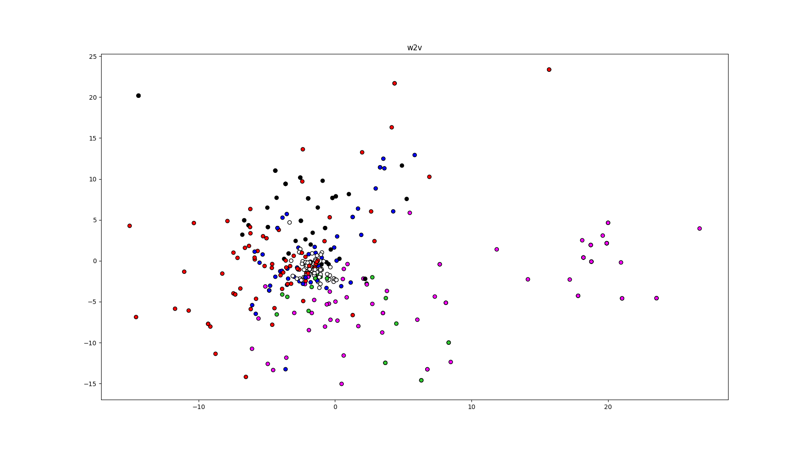

# NLP: Takehome 5 - Topic Extraction

This Python project performs topic extraction on a set of ~1000 given emails (included in .zip format). In addition, it performs featurization using three methods: Word2Vec, FAST, and CBOW, to compare their performance in seperating similar terms.

## Preprocessing

To preprocess the emails, they are loaded and stripped of HTML tags, HTML artifacts, and stop words. Then, the remaining words are lemmatized before saving the cleaned corpora into a set of text files.

For each of the featurization methods, the Scikit-learn library is used to load the data. The data are formatted appropriately before featurization.

## Featurization

Featurization uses Gensim to perform Word2Vec and FAST featurization. Then, Keras is used to train a network for CBOW featurization.

The fully-trained network weights are included in the project repository.

## Topic Extraction

Topic extraction is performed on the emails using LDA topic extraction from Scikit-learn.

## Performance Comparison

Finally, the code compares the performance of each of the featurization methods by plotting similar words to the topic-defining words found by the topic extraction. These words are colored by topic to visualize how well the featurization method seperates out similar topics.

The plots are shown below for CBOW, Word2Vec, and FAST, respectively.

### CBOW

### Word2Vec

### FAST

## Conclusion
Of the 3 featurization methods, it seems like word2vec had the best results, with FAST in second. I tried CBOW and trained for 50 epochs,
but the results didn't seem as good as the other methods in terms of seperating out the different topics. Plus, CBOW took a very long time to train
compared to the other two methods, which were significantly faster.

However, CBOW had the tightest clustering of some similar terms in a few situations. It seems likely that it would have the best performance, given
enough time to train over many more epochs.
